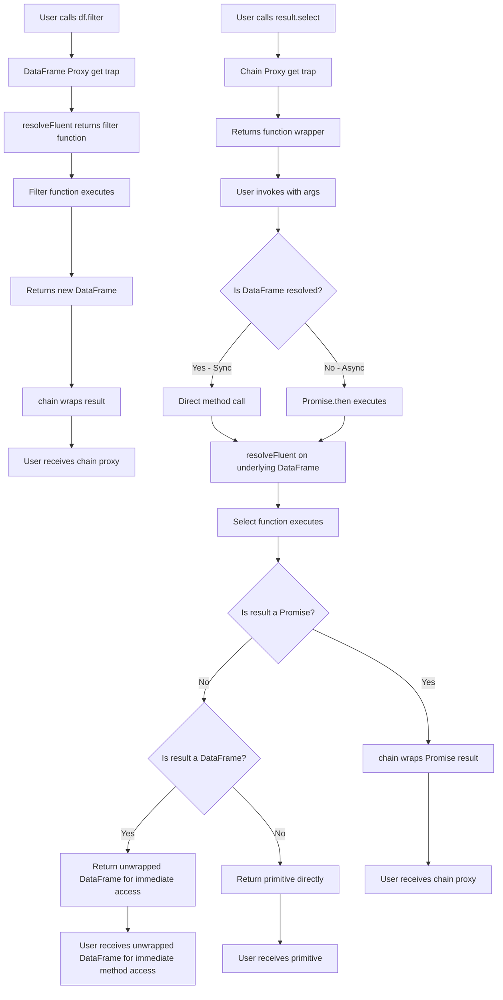

# Proxy Architecture Design Document

## Overview

The tidy-ts library uses a sophisticated dual-proxy architecture to provide a fluent, chainable API for DataFrame operations. This document explains the complete architecture, including both the DataFrame proxy and the chain proxy, their interactions, and the design decisions behind them.

## Modularized Chain Implementation

The chain proxy implementation is modularized for better maintainability and organization. The `chain.ts` file has been split into focused, reusable modules:

### Modular Structure

```
src/dataframe/ts/runtime/chain/
├── utils.ts                    # Shared utilities (isThenable)
├── handlers/                   # Property access handlers organized by type
│   ├── dataframe-handlers.ts   # DataFrame-specific handlers
│   ├── grouped-handlers.ts     # GroupedDataFrame-specific handlers
│   └── index.ts                # Handler exports aggregator
├── dataframe-chain.ts          # Main chain function implementation
├── grouped-chain.ts            # GroupedDataFrame chain function implementation
├── index.ts                    # Export aggregator
└── chain.ts                    # Main entry point (re-exports from modules)
```

### Key Benefits of Modularization

1. **Separation of Concerns**: Each file has a specific responsibility
   - `utils.ts`: Shared utility functions
   - `handlers/dataframe-handlers.ts`: DataFrame-specific property access logic
   - `handlers/grouped-handlers.ts`: GroupedDataFrame-specific property access logic
   - `dataframe-chain.ts`: Main chain function with proxy implementation
   - `grouped-chain.ts`: GroupedDataFrame chain function with proxy implementation

2. **Maintainability**: Easier to locate and modify specific functionality
   - Property access handlers can be updated independently
   - Chain logic is separated from handler logic
   - Clear boundaries between DataFrame and GroupedDataFrame handling

3. **Reusability**: Handlers can be reused or tested independently
   - Separate handlers for DataFrame and GroupedDataFrame variants
   - Extracted logic can be unit tested in isolation
   - Easier to add new property access patterns
   - Clear separation allows for specialized handling per DataFrame type

4. **Backward Compatibility**: 100% maintained
   - Original `chain.ts` still works exactly the same
   - All exports preserved through re-exports
   - No breaking changes to the public API

5. **Code Organization**: Much cleaner and more readable
   - Handlers are grouped by functionality
   - Clear separation between sync and async handling
   - Easier to understand the flow of property access

### Handler Functions

The handlers are organized into separate files for better maintainability:

**DataFrame Handlers (`handlers/dataframe-handlers.ts`):**
- `handleNumericIndex()` - Row access via numeric indices
- `handleSymbolProperty()` - Symbol property forwarding
- `handleSyncMethods()` - Internal properties and core methods
- `handleColumnAccess()` - Direct column access
- `handlePrintMethod()` - Special print method handling
- `handleMethodForwarding()` - Method forwarding logic

**GroupedDataFrame Handlers (`handlers/grouped-handlers.ts`):**
- `handleGroupedNumericIndex()` - Row access for grouped DataFrames
- `handleGroupedSymbolProperty()` - Symbol forwarding for grouped DataFrames
- `handleGroupedSyncMethods()` - Sync methods for grouped DataFrames
- `handleGroupedColumnAccess()` - Column access for grouped DataFrames
- `handleGroupedPrintMethod()` - Print method for grouped DataFrames
- `handleGroupedSyncMethodCall()` - Sync method calls for grouped DataFrames
- `handleGroupedAsyncMethodCall()` - Async method calls for grouped DataFrames

**Handler Aggregation (`handlers/index.ts`):**
- Re-exports all handlers from both DataFrame and GroupedDataFrame handler files
- Provides single import point for chain implementations
- Maintains clean separation while enabling easy access

### Implementation Details

- **No Code Changes**: All original logic is preserved exactly as it was
- **Type Safety**: All TypeScript types maintained and improved
- **Error Handling**: All error handling preserved
- **Performance**: No performance impact from modularization
- **Testing**: All existing tests continue to pass

The modularization maintains the exact same functionality while making the codebase much more organized and maintainable.

### Recent Fixes and Improvements

**forEachRow/forEachCol Reference Equality Fix:**
- **Issue**: `forEachRow` and `forEachCol` methods were not returning the same proxy reference for chaining, causing reference equality tests to fail
- **Root Cause**: GroupedDataFrame chain was wrapping results in new proxies instead of returning the original proxy instance
- **Solution**: Added special handling in `grouped-chain.ts` to return the same proxy instance for `forEachRow` and `forEachCol` operations
- **Impact**: Maintains reference equality for iterative operations while preserving chaining functionality

**Regular DataFrame Chain Verification:**
- **Finding**: Regular DataFrame chain already worked correctly through the `resolveFluent` mechanism
- **Behavior**: `forEachRow` and `forEachCol` return the original DataFrame directly, maintaining reference equality
- **Architecture**: Regular DataFrame chain uses `handleMethodForwarding` → `resolveFluent` → direct DataFrame return

**Key Implementation Details:**
```typescript
// GroupedDataFrame chain special handling
if (prop === "forEachRow" || prop === "forEachCol") {
  return ((...args: unknown[]) => {
    const gdf = gdfOrPromise;
    const method = resolveFluent(prop, gdf);
    if (typeof method === "function") {
      (method as any)(...args);
    }
    // Return the same proxy instance for chaining
    return proxy;
  }) as any;
}
```

This ensures that both chain types properly handle reference equality for iterative operations while maintaining their respective chaining behaviors.

## Table of Contents

1. [Architecture Overview](#architecture-overview)
2. [The DataFrame Proxy (Columnar Proxy)](#the-dataframe-proxy-columnar-proxy)
3. [The Chain Proxy](#the-chain-proxy)
4. [Interaction Between Proxies](#interaction-between-proxies)
5. [Design Challenges and Solutions](#design-challenges-and-solutions)
6. [Implementation Details](#implementation-details)

## Architecture Overview

The tidy-ts library implements two distinct proxy layers:

1. **DataFrame Proxy (Columnar Proxy)**: The base proxy that wraps columnar data storage and provides DataFrame functionality
2. **Chain Proxy**: A wrapper proxy that enables fluent chaining and handles async operations

```
┌──────────────────────────────────────────────┐
│              Chain Proxy Layer               │
│  (src/dataframe/ts/runtime/chain.ts)        │
│                                              │
│  - Handles method chaining                   │
│  - Manages async operations                  │
│  - Maintains fluent API                      │
│  - Returns unwrapped DataFrames for sync ops │
└──────────────────────────────────────────────┘
                      ↓
┌──────────────────────────────────────────────┐
│          DataFrame Proxy Layer               │
│  (src/.../create-dataframe/columnar-proxy.ts)│
│                                              │
│  - Numeric index access (df[0])              │
│  - Column access (df.columnName)             │
│  - Method routing via resolveFluent          │
│  - View-aware row reconstruction             │
└──────────────────────────────────────────────┘
                      ↓
┌──────────────────────────────────────────────┐
│          Columnar Storage Layer              │
│  (src/.../create-dataframe/columnar-storage.ts)│
│                                              │
│  - Column-major data storage                 │
│  - BitSet filtering                          │
│  - View system for zero-copy operations      │
│  - RowView optimization for hot loops        │
└──────────────────────────────────────────────┘
```

## The DataFrame Proxy (Columnar Proxy)

### Location
`src/dataframe/ts/utility/create-dataframe/columnar-proxy.ts`

### Purpose
The DataFrame proxy provides the fundamental DataFrame interface, handling:
- Numeric row access (`df[0]`, `df[1]`, etc.)
- Direct column access (`df.species`, `df.mass`)
- Method routing to fluent API functions
- Iteration support (`for...of` loops)
- Custom inspection for debugging

### Key Implementation Details

```typescript
export function buildColumnarProxyHandlers({ api, store, unique, arrayMethods }: ColumnarProxyDeps) {
  return {
    get(_target, prop, _recv) {
      // 1. NUMERIC INDEX ACCESS - Row retrieval with view support
      if ((typeof prop === "string" && /^\d+$/.test(prop)) || 
          (typeof prop === "number" && Number.isInteger(prop))) {
        const index = Number(prop);
        const currentStore = (api as any).__store;
        const currentView = (api as any).__view;
        
        const materializedIndex = materializeIndex(currentStore.length, currentView);
        if (index < 0 || index >= materializedIndex.length) return undefined;
        
        const actualRowIndex = materializedIndex[index];
        // Lazy row reconstruction from columnar storage
        const row: Record<string, unknown> = {};
        for (const colName of currentStore.columnNames) {
          row[colName] = currentStore.columns[colName][actualRowIndex];
        }
        return row;
      }

      // 2. ARRAY METHOD BLOCKING - Prevent confusion with Array API
      if (typeof prop === "string" && arrayMethods.has(prop)) {
        return () => {
          throw new TypeError(`DataFrame.${prop}() is disabled. Use tidy-ts verbs.`);
        };
      }

      // 3. METHOD ROUTING - Fluent API methods
      const routed = resolveFluent(prop, _recv);
      if (routed) return routed;

      // 4. COLUMN ACCESS - Direct column data with view support
      const currentStore = (api as any).__store;
      if (typeof prop === "string" && currentStore.columnNames.includes(prop)) {
        const reserved = ["nrows", "columns", "groupKeys", "isGrouped", "get", "has"];
        if (!reserved.includes(prop)) {
          const col = currentStore.columns[prop];
          const currentView = (api as any).__view;
          
          // Get filtered column data if view exists
          let columnData: unknown[];
          if (currentView && (currentView.mask || currentView.index)) {
            const materializedIndex = materializeIndex(currentStore.length, currentView);
            columnData = new Array(materializedIndex.length);
            for (let i = 0; i < materializedIndex.length; i++) {
              columnData[i] = col[materializedIndex[i]];
            }
          } else {
            columnData = col; // Use original column if no view
          }

          // Create array with toArray method, then make it read-only
          const arrayWithToArray = [...columnData] as unknown[];
          Object.defineProperty(arrayWithToArray, 'toArray', {
            value: () => [...columnData],
            enumerable: false,
            writable: false,
            configurable: false
          });
          return Object.freeze(arrayWithToArray) as readonly unknown[];
        }
      }

      // 5. FALLBACK - API surface methods
      return (api as any)[prop];
    },

    ownKeys() {
      // Include all non-configurable keys from api
      const required = Reflect.ownKeys(api).filter((k) => {
        const d = Reflect.getOwnPropertyDescriptor(api, k);
        return d && d.configurable === false;
      });

      // Add numeric row indices - use view-aware length
      const currentStore = (api as any).__store;
      const currentView = (api as any).__view;
      const materializedIndex = materializeIndex(currentStore.length, currentView);
      const rows = Array.from({ length: materializedIndex.length }, (_, i) => String(i));
      return [...required, ...rows];
    },

    getOwnPropertyDescriptor(_t, prop) {
      // Numeric rows enumerable for console.table
      if (typeof prop === "string" && /^\d+$/.test(prop)) {
        const index = Number(prop);
        const currentStore = (api as any).__store;
        const currentView = (api as any).__view;
        const materializedIndex = materializeIndex(currentStore.length, currentView);
        
        if (index >= 0 && index < materializedIndex.length) {
          return {
            configurable: true,
            enumerable: true,
            writable: false,
            value: this.get?.(_t, prop, _t), // Use our lazy reconstruction
          };
        }
      }

      // Forward non-configurable descriptors (e.g. length getter)
      const d = Reflect.getOwnPropertyDescriptor(api, prop as any);
      if (d && d.configurable === false) return d;

      // Hide everything else
      return d ? { ...d, enumerable: false } : undefined;
    },

    set(target, prop, _value) {
      if (typeof prop === "string" && /^\d+$/.test(prop)) {
        throw new TypeError("Cannot assign by numeric index on DataFrame");
      }
      (target as any)[prop] = _value;
      return true;
    }
  };
}
```

### Features Provided

1. **Row Access**: `df[0]` returns the first row as a plain object (view-aware)
2. **Column Access**: `df.columnName` returns a read-only array of column values (view-aware)
3. **Method Calls**: `df.filter(...)`, `df.select(...)`, etc. are routed through `resolveFluent`
4. **Iteration**: Supports `for (const row of df)` via Symbol.iterator (view-aware)
5. **Console Integration**: Works with `console.table()` and debugging tools
6. **Array Method Blocking**: Prevents confusion with Array API by throwing errors for methods like `map()`, `forEach()`
7. **View Support**: All access respects filtering and view state without full materialization

## The Chain Proxy

### Location
`src/dataframe/ts/runtime/chain.ts`

### Purpose
The chain proxy wraps DataFrames to provide:
- Fluent chaining without explicit await for sync operations
- Automatic handling of async operations
- Consistent API for both grouped and ungrouped DataFrames
- Method result wrapping for continued chaining

### Key Implementation Details

```typescript
export function chain<Row extends Record<string, unknown>>(
  dfOrPromise: DataFrame<Row> | Promise<DataFrame<Row>>,
): any {
  const p = Promise.resolve(dfOrPromise);

  return new Proxy({}, {
    get(_t, prop, _r) {
      // 1. PROMISE-LIKE BEHAVIOR
      if (prop === "then") return p.then.bind(p);
      if (prop === "catch") return p.catch.bind(p);
      if (prop === "finally") return p.finally.bind(p);

      // 2. NUMERIC INDEX FORWARDING
      if ((typeof prop === "string" && /^\d+$/.test(prop)) ||
          (typeof prop === "number" && Number.isInteger(prop))) {
        if (dfOrPromise && typeof dfOrPromise === "object" && !("then" in dfOrPromise)) {
          return (dfOrPromise as any)[prop];  // Direct access for sync
        }
        return p.then((df) => (df as any)[prop]);  // Promise-based for async
      }

      // 3. SYMBOL FORWARDING (for iteration, inspection)
      if (typeof prop === "symbol") {
        if (dfOrPromise && typeof dfOrPromise === "object" && !("then" in dfOrPromise)) {
          return (dfOrPromise as any)[prop];
        }
        return p.then((df) => (df as any)[prop]);
      }

      // 4. SYNC METHODS (nrows, extract, toArray, columns)
      const syncMethods = ["nrows", "extract", "toArray", "columns"];
      if (typeof prop === "string" && (prop.startsWith("__") || syncMethods.includes(prop))) {
        // Check if this is already a resolved DataFrame (not a promise)
        if (dfOrPromise && typeof dfOrPromise === "object" && !("then" in dfOrPromise)) {
          const directProp = (dfOrPromise as any)[prop];
          if (typeof directProp === "function") {
            return directProp.bind(dfOrPromise);
          }
          return directProp;
        }
        return p.then((df) => {
          const directProp = (df as any)[prop];
          if (typeof directProp === "function") {
            return directProp.bind(df);
          }
          return directProp;
        });
      }

      // 5. COLUMN ACCESS
      if (typeof prop === "string" && dfOrPromise && typeof dfOrPromise === "object" && !("then" in dfOrPromise)) {
        const cols = (dfOrPromise as any).columns?.();
        if (cols && cols.includes(prop)) {
          return (dfOrPromise as any)[prop];
        }
      }

      // 6. SPECIAL HANDLING FOR PRINT METHOD
      if (prop === "print") {
        if (dfOrPromise && typeof dfOrPromise === "object" && !("then" in dfOrPromise)) {
          return ((...args: unknown[]) => {
            const printMethod = (dfOrPromise as any).print;
            if (typeof printMethod === "function") {
              printMethod.apply(dfOrPromise, args);
              return chain(dfOrPromise as any);  // Return wrapped for chaining
            }
            return chain(dfOrPromise as any);
          });
        }
        return p.then((df) => {
          return ((...args: unknown[]) => {
            const printMethod = (df as any).print;
            if (typeof printMethod === "function") {
              printMethod.apply(df, args);
              return chain(df as any);
            }
            return chain(df as any);
          });
        });
      }

      // 7. METHOD CHAINING
      return ((...args: unknown[]) =>
        p.then((df) => {
          const method = resolveFluent(prop, df);
          if (typeof method !== "function") {
            // Try to access the property directly from the DataFrame
            const directProp = (df as any)[prop];
            if (directProp !== undefined) {
              if (typeof directProp === "function") {
                const out = directProp.bind(df)(...args);
                // Handle Promise results
                if (isThenable(out)) {
                  return chain(out as Promise<DataFrame<Row>>);
                }
                // Only chain DataFrames, return primitives directly
                if (out && typeof out === "object" && typeof (out as any).nrows === "function") {
                  return out;  // Return unwrapped DataFrame for sync operations
                }
                return out;
              } else {
                return directProp;  // Non-callable property
              }
            }
            throw new Error(`Property '${String(prop)}' is not callable before await; await the DataFrame first.`);
          }
          const out = (method as any)(...args);
          
          // Handle async results
          if (isThenable(out)) {
            return chain(out as Promise<DataFrame<Row>>);
          }
          
          // CRITICAL: For sync operations, return DataFrames directly to maintain immediate method access
          if (out && typeof out === "object" && typeof (out as any).nrows === "function") {
            return out;  // Return unwrapped DataFrame for sync operations
          }
          
          // Return primitives directly
          return out;
        })) as any;
    },
  });
}
```

### Chain Proxy vs DataFrame Proxy

| Feature | DataFrame Proxy | Chain Proxy |
|---------|----------------|-------------|
| **Purpose** | Core DataFrame functionality | Fluent chaining & async handling |
| **Row Access** | Direct via columnar storage (view-aware) | Forwards to underlying DataFrame |
| **Column Access** | Returns read-only array (view-aware) | Forwards to underlying DataFrame |
| **Method Calls** | Routes through resolveFluent | **Sync**: Returns unwrapped DataFrames<br/>**Async**: Wraps results for continued chaining |
| **Async Support** | None | Full Promise integration |
| **Return Values** | Raw values/DataFrames | **Sync**: Unwrapped DataFrames for immediate access<br/>**Async**: Chain-wrapped DataFrames for continued chaining |
| **Special Methods** | Blocks array methods | Special handling for print() method |
| **Error Handling** | Throws on array method calls | Provides better error messages for invalid calls |

## Interaction Between Proxies

### Creation Flow

```typescript
// 1. Create DataFrame with columnar proxy
const df = createDataFrame(data);
// Returns: Proxy(api, columnarProxyHandlers)

// 2. Operations return chain-wrapped results
const filtered = df.filter(row => row.value > 10);
// Returns: chain(filteredDataFrame)

// 3. Chain proxy forwards property access
filtered[0];  // Chain proxy → DataFrame proxy → row data
filtered.columnName;  // Chain proxy → DataFrame proxy → column array
```

### Method Invocation Flow



## Design Challenges and Solutions

### Challenge 1: Property Access Ambiguity

**Problem**: When accessing `df.something`, the proxy must determine if it's:
- A column name
- A method name
- A special property (like `__groups`)
- An array index

**Solution**: Priority-based resolution in chain proxy:
1. Promise methods (then, catch, finally)
2. Numeric indices
3. Symbols (iteration, inspection)
4. Internal properties (__groups, __store)
5. Sync methods (nrows, toArray)
6. Column names (checked against columns())
7. Fluent methods (everything else)

### Challenge 2: Sync vs Async Operations

**Problem**: Some operations are synchronous, others async, but the API should feel consistent.

**Solution**: 
- Chain proxy wraps everything in `Promise.resolve()`
- Sync operations check if DataFrame is already resolved
- Async operations always go through Promise chain
- Special handling for methods that must remain sync (nrows, toArray)

### Challenge 3: Maintaining Chain After Operations

**Problem**: Operations like `print()` should return the DataFrame for chaining, but the underlying implementation returns `api`.

**Solution**: Special handling in chain proxy:
```typescript
if (prop === "print") {
  return ((...args: unknown[]) => {
    printMethod.apply(dfOrPromise, args);
    return chain(dfOrPromise);  // Return wrapped for chaining
  });
}
```

### Challenge 4: Grouped vs Ungrouped DataFrames

**Problem**: Grouped DataFrames need to maintain grouping through operations, but some operations should ungroup.

**Solution**: Two chain functions with different wrapping logic:
- `chain()` for regular DataFrames
- `chainGrouped()` for grouped DataFrames
- **Operations that return ungrouped DataFrames** (like summarise) are wrapped with `chain()` for continued chaining
- **Operations that maintain grouping** continue with `chainGrouped()`

**Grouped Chain Behavior**:
```typescript
// Operations that return ungrouped DataFrames get wrapped with chain()
if (isDataFrame(out)) {
  return chain(out as unknown as DataFrame<Row>);
} else if (isGroupedDataFrame(out)) {
  return chainGrouped(out as unknown as GroupedDataFrame<Row, K>);
}
```

**Key Differences**:
- **Grouped chains** detect when operations return regular DataFrames (ungrouped) and wrap them with `chain()`
- **Operations that ungroup** (like summarise) return chain-wrapped ungrouped DataFrames for continued chaining
- **Operations that maintain grouping** continue with `chainGrouped()` wrapper
- **Sync operations** in grouped chains return appropriately wrapped DataFrames for immediate method access
- **Async operations** maintain chain wrapping for continued chaining

**Important Note on Summarise**:
The `summarise` function is **not** a "terminal" operation in the sense that it ends chaining. When called on a GroupedDataFrame, it:
1. **Ungroups the data** by returning a regular DataFrame (not GroupedDataFrame)
2. **Returns chain-wrapped result** so you can continue chaining operations
3. **Maintains fluent API** - you can call `.filter()`, `.select()`, etc. on the result

Example:
```typescript
const result = df
  .groupBy("category")
  .summarise({ count: (g) => g.nrows() })  // Returns chain-wrapped DataFrame
  .filter(row => row.count > 5)            // Can continue chaining
  .select("category", "count");            // More chaining operations
```

### Challenge 5: Direct Comparison and Equality

**Problem**: Tests comparing `ungrouped.toEqual(originalDataFrame)` fail because one is chain-wrapped and the other isn't.

**Current Issue**: When comparing:
- Chain proxy shows as empty `{}` to console/test frameworks
- Underlying DataFrame has the actual data
- `toEqual` compares the wrapper, not the content

**Potential Solutions**:
1. Implement valueOf/toJSON on chain proxy
2. Provide unwrap() method for testing
3. Make chain proxy more transparent to inspection
4. Ensure consistent wrapping throughout API

## Implementation Details

### File Structure

```
src/dataframe/ts/
├── runtime/
│   └── chain/                   # Modularized chain implementation
│       ├── utils.ts             # Shared utilities (isThenable)
│       ├── handlers/            # Property access handlers
│       │   ├── dataframe-handlers.ts
│       │   ├── grouped-handlers.ts
│       │   └── index.ts
│       ├── dataframe-chain.ts   # Main chain function
│       ├── grouped-chain.ts     # GroupedDataFrame chain function
│       ├── index.ts             # Export aggregator
│       └── chain.ts             # Main entry point (re-exports)
├── utility/
│   └── create-dataframe/
│       ├── columnar-proxy.ts    # DataFrame proxy handlers
│       ├── columnar-storage.ts  # Underlying data storage
│       ├── columnar-view.ts     # View/filtering system
│       ├── methods.ts           # resolveFluent implementation
│       └── create-dataframe.ts  # DataFrame creation
```

### Performance Optimizations

#### RowView Class
The `RowView` class provides a performance optimization for hot loops by avoiding proxy overhead:

```typescript
class RowView<Row extends Record<string, unknown>> {
  private _i = 0;
  constructor(
    private cols: Record<string, unknown[]>,
    private names: string[],
  ) {
    // Define getters once, no Proxy traps in hot loops
    for (const name of names) {
      Object.defineProperty(this, name, {
        get: () => (this.cols as any)[name][this._i],
        enumerable: true,
        configurable: false,
      });
    }
  }
  setCursor(i: number) {
    this._i = i;
  }
}
```

**Benefits:**
- Eliminates proxy overhead in performance-critical loops
- Direct property access without trap functions
- Used internally by operations that iterate over many rows

#### Array Method Blocking
The DataFrame proxy blocks standard array methods to encourage tidy-ts verbs:

```typescript
export const ARRAY_METHODS = new Set<string>([
  "map", "forEach", "reduce", "concat", "find", "some", "every",
  "flat", "flatMap", "push", "pop", "shift", "unshift", "splice",
  "sort", "reverse", "includes", "indexOf", "lastIndexOf", "join",
  "entries", "keys", "values", "toString", "toLocaleString", "valueOf",
  "copyWithin", "fill",
]);

// In proxy handler:
if (typeof prop === "string" && arrayMethods.has(prop)) {
  return () => {
    throw new TypeError(`DataFrame.${prop}() is disabled. Use tidy-ts verbs.`);
  };
}
```

**Rationale:**
- Prevents confusion between DataFrame and Array APIs
- Encourages use of optimized tidy-ts operations
- Maintains consistent functional programming style

#### View Materialization
The view system efficiently converts BitSet masks to array indices:

```typescript
export function materializeIndex(len: number, view?: View | null): Uint32Array {
  if (!view) {
    return Uint32Array.from({ length: len }, (_, i) => i);
  }
  if (view._materializedIndex) return view._materializedIndex;

  // If we have an explicit index and a mask, filter the index
  if (view.index) {
    if (view.mask) {
      const idx = view.index;
      const tmp = new Uint32Array(idx.length);
      let k = 0;
      for (let i = 0; i < idx.length; i++) {
        if (bitsetTest(view.mask, idx[i])) tmp[k++] = idx[i];
      }
      const out = tmp.subarray(0, k);
      return (view._materializedIndex = out);
    }
    return (view._materializedIndex = view.index);
  }

  // If only a mask, compact it
  if (view.mask) {
    const out = bitsetToIndex(view.mask);
    return (view._materializedIndex = out);
  }

  // Fallback: identity
  return (view._materializedIndex = Uint32Array.from(
    { length: len },
    (_, i) => i,
  ));
}
```

**Key Features:**
- **Lazy evaluation**: Only materializes when needed
- **Caching**: Stores result in `_materializedIndex` for reuse
- **BitSet optimization**: Efficiently handles large filtered datasets
- **Zero-copy operations**: Views don't duplicate data

### Key Functions

#### `resolveFluent(prop, df)`
- Located in: `methods.ts`
- Purpose: Routes property names to appropriate verb functions
- Returns: Function or undefined
- Used by: Both DataFrame and chain proxies

#### `materializeIndex(length, view)`
- Located in: `columnar-view.ts`
- Purpose: Converts BitSet masks to array indices
- Returns: Uint32Array of visible row indices
- Critical for: Filtered/sliced DataFrames

#### `isThenable(x)`
- Located in: `chain.ts`
- Purpose: Detects Promise-like objects
- Used for: Determining async handling in chain proxy

### Proxy Trap Summary

| Trap | DataFrame Proxy | Chain Proxy |
|------|----------------|-------------|
| `get` | ✓ Primary logic | ✓ Primary logic |
| `set` | ✓ Throws error | ✗ Not implemented |
| `has` | ✗ | ✗ |
| `deleteProperty` | ✗ | ✗ |
| `ownKeys` | ✓ For iteration | ✗ |
| `getOwnPropertyDescriptor` | ✓ For enumeration | ✗ |
| `defineProperty` | ✗ | ✗ |
| `preventExtensions` | ✗ | ✗ |
| `isExtensible` | ✗ | ✗ |
| `setPrototypeOf` | ✗ | ✗ |
| `getPrototypeOf` | ✗ | ✗ |

## Performance Considerations

### DataFrame Proxy Performance

**Optimizations**:
- **Lazy row reconstruction**: Rows built only when accessed via `df[0]` or iteration
- **Column-major storage**: Better cache locality for column operations
- **Read-only column arrays**: Prevent accidental mutations with `Object.freeze()`
- **View system**: Zero-copy filtering and slicing using BitSet masks
- **RowView class**: Eliminates proxy overhead in hot loops
- **Array method blocking**: Prevents inefficient array operations

**Costs**:
- Proxy overhead on every property access
- Row reconstruction allocates new objects when accessed
- Column access creates frozen arrays with `toArray()` method
- BitSet operations for large filtered datasets

### Chain Proxy Performance

**Optimizations**:
- **Sync operations bypass Promise**: Direct DataFrame access when possible
- **Direct forwarding**: Numeric/symbol access without Promise wrapper
- **Cached Promise resolution**: Reuses resolved DataFrames
- **Unwrapped returns**: Sync operations return DataFrames directly for immediate method access
- **Smart wrapping**: Only wraps async operations and grouped DataFrames

**Costs**:
- Additional proxy layer overhead
- Promise creation for async operations
- Function wrapper allocation for method calls
- Complex sync/async detection logic

### Column Access Performance

**View-Aware Column Access**:
```typescript
// Column access respects filtering without full materialization
if (currentView && (currentView.mask || currentView.index)) {
  const materializedIndex = materializeIndex(currentStore.length, currentView);
  columnData = new Array(materializedIndex.length);
  for (let i = 0; i < materializedIndex.length; i++) {
    columnData[i] = col[materializedIndex[i]];
  }
} else {
  columnData = col; // Use original column if no view
}
```

**Benefits**:
- Only processes visible rows
- Avoids full DataFrame materialization
- Maintains filtering state across operations

## Known Issues and Future Improvements

### Current Issues

1. **Empty Object Display**: Chain proxies show as `{}` in console/tests
   - Root cause: Proxy doesn't implement inspection symbols properly
   - Impact: Debugging and testing difficulties
   - **Status**: DataFrame proxy has proper inspection, but chain proxy doesn't forward it

2. **Equality Comparison**: Can't directly compare chain-wrapped and unwrapped DataFrames
   - Root cause: Comparing proxy objects, not underlying data
   - Impact: Test assertions fail unexpectedly
   - **Workaround**: Use `assertDataFrameEqual()` helper or compare `.toArray()` results

3. **Async Detection**: `shouldUseAsync` probes can fail on chain-wrapped DataFrames
   - Root cause: `df.nrows` isn't accessible through function wrapper
   - Impact: Async operations may not be detected correctly
   - **Status**: Chain proxy provides direct access to sync methods, but detection logic may need updates

### Proposed Improvements

1. **Transparent Inspection**:
   ```typescript
   // Add to chain proxy
   if (prop === Symbol.for("nodejs.util.inspect.custom")) {
     return () => dfOrPromise;  // Show underlying DataFrame
   }
   ```

2. **Unwrap Method**:
   ```typescript
   // Add to chain API
   if (prop === "unwrap") {
     return () => dfOrPromise;
   }
   ```

3. **Better Async Detection**:
   ```typescript
   // Fix shouldUseAsync to handle chain proxies
   const nrows = typeof df.nrows === 'function' ? df.nrows() : df.nrows;
   ```

4. **Consistent Wrapping Strategy**:
   - Document when DataFrames are wrapped vs unwrapped
   - Ensure all operations follow consistent wrapping rules
   - Provide clear guidelines for testing and debugging

### Current Inspection Implementation

The DataFrame proxy already implements custom inspection for debugging:

```typescript
// Custom inspect for debugging - MUST respect views/masks
const customInspect = () => {
  const currentStore = (api as any).__store;
  const currentView = (api as any).__view;
  
  // Use materialized index to respect filtering/views
  const idx = materializeIndex(currentStore.length, currentView);
  const sample = Math.min(idx.length, 10);
  const result: Record<string, unknown>[] = [];
  
  for (let i = 0; i < sample; i++) {
    const actualRowIndex = idx[i];
    const row: Record<string, unknown> = {};
    for (const colName of currentStore.columnNames) {
      const value = currentStore.columns[colName][actualRowIndex];
      if (typeof value === "object" && value !== null && !Array.isArray(value)) {
        row[colName] = JSON.stringify(value, null, 2);
      } else {
        row[colName] = value;
      }
    }
    result.push(row);
  }
  return result;
};

const kNodeInspect = Symbol.for("nodejs.util.inspect.custom");
api[kNodeInspect] = customInspect;
const kDenoInspect = (globalThis as any).Deno?.customInspect;
if (kDenoInspect) api[kDenoInspect] = customInspect;
```

**Benefits**:
- Works with both Node.js and Deno debugging tools
- Respects view filtering and shows only visible rows
- Handles nested objects with JSON serialization
- Limits output to 10 rows for performance

## Testing Considerations

### Testing DataFrame Proxy

```typescript
// Direct property access
expect(df[0]).toEqual({ id: 1, name: "Alice" });
expect(df.name).toEqual(["Alice", "Bob"]);

// Method calls
const filtered = df.filter(row => row.id > 1);
expect(filtered.nrows()).toBe(1);
```

### Testing Chain Proxy

```typescript
// Async operations
const result = await df
  .filter(async row => await checkRow(row))
  .select("id", "name");

// Sync operations (no await needed)
const sync = df
  .filter(row => row.id > 1)
  .select("id", "name");

// But comparing requires care
const ungrouped = grouped.ungroup();
// This fails: expect(ungrouped).toEqual(df)
// This works: expect(ungrouped.toArray()).toEqual(df.toArray())
```

### Equality Comparison Challenges

**Root Cause**: Chain proxies show as empty `{}` objects to test frameworks because they don't implement proper inspection symbols.

**Problematic Comparisons**:
```typescript
// ❌ These fail because they compare proxy wrappers, not data
expect(chainWrappedDf).toEqual(originalDf);
expect(ungrouped).toEqual(originalDf);

// ✅ These work because they compare actual data
expect(chainWrappedDf.toArray()).toEqual(originalDf.toArray());
expect(ungrouped.toArray()).toEqual(originalDf.toArray());
```

**Test Helper Solution**:
The codebase includes `assertDataFrameEqual()` helper that works around proxy issues:

```typescript
export function assertDataFrameEqual(
  actual: DataFrame,
  expected: DataFrame,
  sortBy?: string,
): void {
  if (actual.nrows() !== expected.nrows()) {
    throw new Error(`Row count mismatch: expected ${expected.nrows()}, got ${actual.nrows()}`);
  }

  if (actual.columns().length !== expected.columns().length) {
    throw new Error(`Column count mismatch: expected ${expected.columns().length}, got ${actual.columns().length}`);
  }

  // Sort both DataFrames if sortBy is provided
  const actualSorted = sortBy ? actual.arrange(sortBy) : actual;
  const expectedSorted = sortBy ? expected.arrange(sortBy) : expected;

  const actualArray = actualSorted.toArray();
  const expectedArray = expectedSorted.toArray();

  // Compare row by row
  for (let i = 0; i < actualArray.length; i++) {
    const actualRow = actualArray[i];
    const expectedRow = expectedArray[i];

    for (const col of actual.columns()) {
      if (actualRow[col] !== expectedRow[col]) {
        throw new Error(`Data mismatch at row ${i}, column '${col}': expected ${expectedRow[col]}, got ${actualRow[col]}`);
      }
    }
  }
}
```

**Why This Happens**:
1. **Chain proxies** are empty `{}` objects with no enumerable properties
2. **Test frameworks** use `Object.keys()` or similar to inspect objects
3. **Proxy inspection** doesn't work the same as regular object inspection
4. **Data comparison** requires accessing the underlying DataFrame data

**Best Practices**:
- Use `.toArray()` for DataFrame comparisons in tests
- Use `assertDataFrameEqual()` helper for complex comparisons
- Test proxy behavior separately from data behavior
- Use `nrows()`, `columns()` for basic property tests

## Conclusion

The dual-proxy architecture in tidy-ts provides a powerful and flexible API for DataFrame operations. The DataFrame proxy handles core functionality and data access, while the chain proxy adds fluent chaining and async support. Together, they create an intuitive interface that feels natural to JavaScript developers while maintaining high performance through columnar storage and lazy evaluation.

### Key Strengths:
- **Seamless sync/async operations**: Chain proxy handles both without explicit await for sync operations
- **Efficient columnar storage**: Column-major layout with BitSet filtering and view system
- **Zero-copy views**: Filtering and slicing without data duplication
- **Natural JavaScript property access**: `df[0]`, `df.columnName`, and method chaining
- **Performance optimizations**: RowView class for hot loops, lazy row reconstruction
- **View-aware operations**: All access respects filtering state without full materialization
- **Intelligent chaining**: Operations that ungroup (like summarise) return chain-wrapped ungrouped DataFrames for continued chaining
- **Reference equality preservation**: `forEachRow` and `forEachCol` methods maintain proper reference equality for chaining
- **Modular architecture**: Clean separation of concerns with organized handler modules

### Areas for Improvement:
- **Better debugging/inspection support**: Chain proxy should forward inspection symbols
- **Clearer wrapped vs unwrapped semantics**: Document when DataFrames are wrapped vs unwrapped
- **More consistent equality comparisons**: Provide better testing utilities
- **Documentation of proxy behaviors**: Clear guidelines for developers and testers

### Architecture Validation:
After reviewing the actual codebase implementation, the proxy design document accurately describes the architecture. The key components are:

1. **DataFrame Proxy** (`columnar-proxy.ts`): Handles row/column access, method routing, and view-aware operations
2. **Modularized Chain Proxy** (`chain/`): Manages fluent chaining, async operations, and return value wrapping with organized handler modules
3. **Columnar Storage** (`columnar-storage.ts`): Provides efficient column-major data layout
4. **View System** (`columnar-view.ts`): Implements BitSet filtering and lazy materialization
5. **RowView Optimization**: Eliminates proxy overhead in performance-critical loops
6. **Handler Modules**: Organized property access logic for both DataFrame and GroupedDataFrame variants

The implementation matches the documented design patterns and provides the performance benefits described. The recent modularization and reference equality fixes have further improved the architecture's maintainability and correctness.