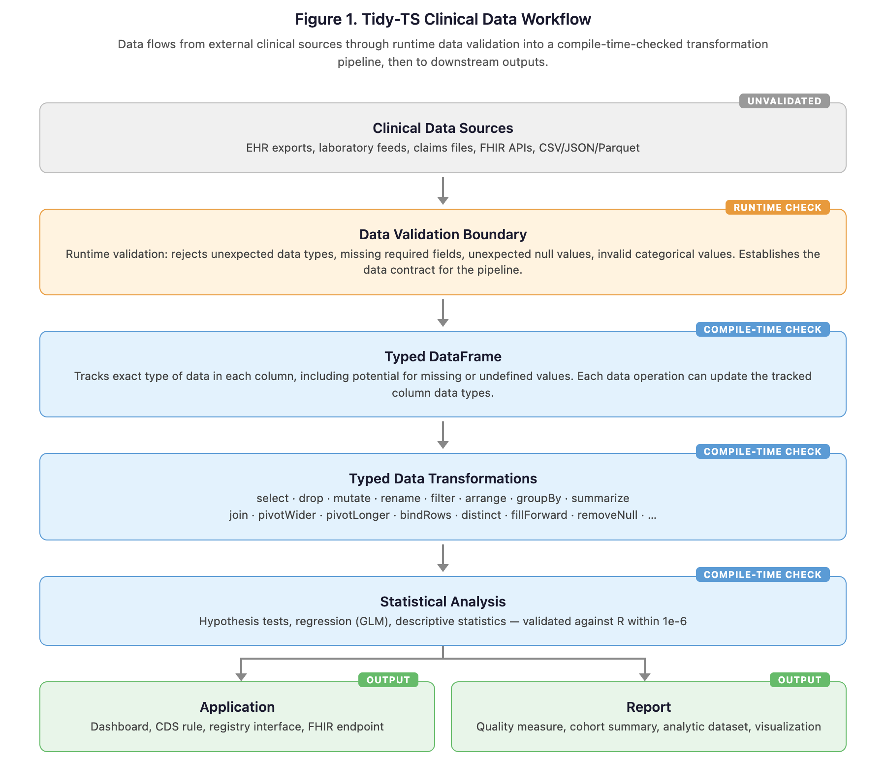
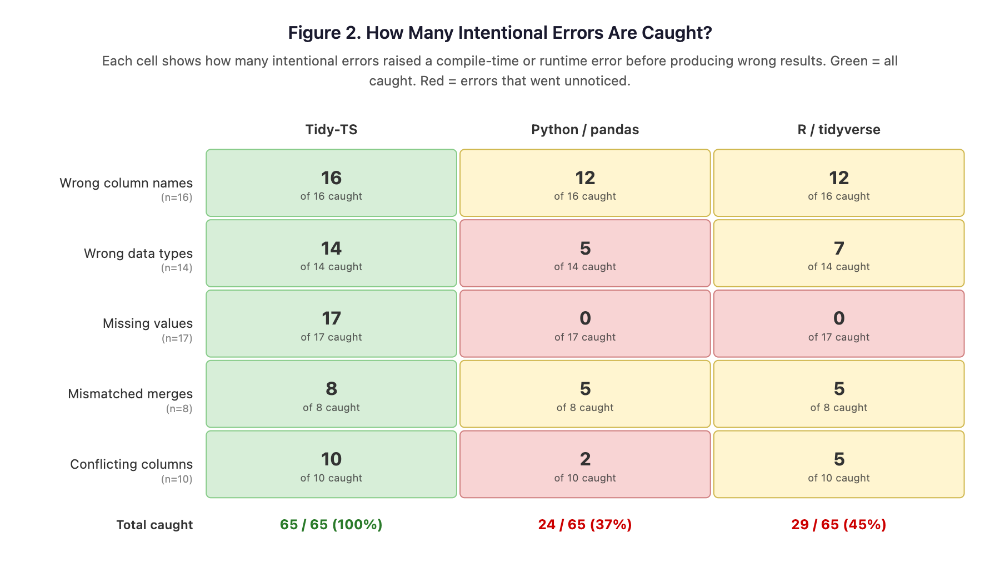

# Compile-Time Error Detection for Clinical Data Analysis: Design and Evaluation of a TypeScript-Based Dataframe Framework

## Abstract

### Objective

Clinical data analyses often require many table operations, including selecting columns, joining patient and encounter records, reshaping laboratory and vital-sign data, converting strings to numbers or dates, and handling missing values. Small mistakes in these steps can produce incorrect results, especially when errors are not detected until late in the workflow or continue without warning. This study evaluates whether a dataframe framework built on TypeScript's type system can detect common clinical data transformation errors before the code runs.

### Materials and Methods

We developed Tidy-TS, a TypeScript framework for clinical data analysis that includes dataframe operations, statistical functions, and input validation. Tidy-TS tracks the available columns and their types as the dataframe changes, so that errors such as referencing a missing column, using a value that might be null, or treating text as a number are caught before the code runs. We evaluated the framework with a cross-ecosystem comparison suite using sample clinical datasets representing patients, encounters, laboratory results, medications, and vital signs. Equivalent tests were implemented in Tidy-TS, Python (using pandas), and R (using tidyverse). Each outcome was classified as a compile-time error, runtime error, runtime warning, or silent continuation. Tests were also classified by severity.

### Results

The comparison suite included 65 tests across five error categories. Tidy-TS rejected 62 of 65 errors before the code ran and caught the remaining 3 through input validation. Pandas caught 24 at runtime and missed 41. Tidyverse caught 25 at runtime, warned on 4, and missed 36. The gap was largest for High-severity errors: all 30 continued silently in pandas, and 27 of 30 in tidyverse. None continued silently in Tidy-TS. The null and missing data category accounted for 12 of the 30 High-severity errors, and all 12 continued silently in both pandas and tidyverse.

### Conclusion

Tidy-TS demonstrates that many common clinical data errors can be caught before the code runs by tracking column names, types, and missing values through each table operation. This approach does not replace Python, R, clinical review, or statistical validation, but it catches errors that continue silently in conventional tools, particularly in the most consequential categories.

---

## Background and Significance

### Clinical Data Transformation Errors Are Common, Consequential, and Often Invisible

Clinical data work depends on tables. Patient demographics, encounters, diagnoses, medications, laboratory results, vital signs, claims, and device streams are usually transformed through a series of table operations before they are analyzed. A typical workflow may read data from files or databases, select a subset of columns, join several tables, convert strings into numbers or dates, reshape long data into wide form, group records by patient or encounter, summarize measurements, and then pass the result into a statistical model or dashboard.

These steps are routine, but they are also a well-documented source of error. And the consequences of such errors can be large enough to change study conclusions.[4][6][7] A column may be misspelled. A column that existed early in a pipeline may no longer exist. Missing values can be introduced after joining two data tables with incomplete data. Numeric laboratory results might have a string of text where a number was expected. A missing dose quantity might lead a medication prescription to be misinterpreted, converted, or silently excluded depending on the programming language being used. 

Most clinical data analysis is performed in Python or R, both powerful and widely used programming languages but designed so that many errors can only be discovered after the code runs. Some errors are clear because the program stops immediately after the error occurs. Others are harder to detect because the program continues and may produce a plausible result. Silent continuation is particularly risky in clinical data workflows because an apparently valid result may be used downstream for cohort definition, quality measurement, modeling, or clinical decision support. 

One analysis found that 25 to 58% of eligible patients were silently dropped from a breast cancer cohort before any researcher touched the data.[11] In a survey across 14 US sites, nearly all Chief Medical Information Officers reported at least one alert malfunction caused by data changes that silently broke decision logic.[10]

In contrast to tools like Python and R, programming languages with static type systems are designed specifically to prevent errors before code is run. These languages are widely used in other fields of software engineering, mathematics, and computer science, and the theoretical foundation for provably increasing accuracy is well established. Sound static type systems guarantee the absence of certain classes of runtime errors by construction.[18][19]

Two independent studies found that static type checking could detect approximately 15% of real-world bugs in JavaScript and Python codebases, with null misuse, stale references, and type mismatches among the most common preventable categories.[20][21] These are the same error classes that arise in dataframe transformation work.

TypeScript is increasingly used in clinical informatics for FHIR-based interoperability tools, web dashboards, and application programming interfaces.[26][27][28] The language recently surpassed Python as the most used programming language on GitHub, in part because typed languages make AI-assisted coding more reliable in production.[25]

Despite this prevalence, TypeScript has not traditionally been used as a primary language for data analysis. Clinical applications that receive, transform, and display patient data in TypeScript typically export that data to Python or R for analysis, then re-import results. This boundary crossing introduces its own opportunities for error and makes end-to-end type safety impossible.

Data quality evaluation is moving from best practice toward regulatory expectation for clinical AI products.[29][30]

This study evaluates whether a data analysis framework built on TypeScript's static type system can detect a meaningful class of clinical data transformation errors compared to conventional dynamic workflows, and characterizes the practical limits of this approach.

---

## Objective

We developed Tidy-TS, a dataframe framework for clinical data analysis in TypeScript. The evaluation addressed three questions.

1. Can TypeScript's type system track data column names, types, and missingness through clinical data transformations, and reject invalid operations before code runs?
2. How do equivalent clinical data errors behave in Tidy-TS compared to Python/pandas and R/tidyverse?
3. Where does compile-time checking end and runtime validation remain necessary?

---

## Materials and Methods

### System Design

Tidy-TS is a TypeScript framework for working with tabular data. It provides a dataframe abstraction for arrays of objects, which are common in JavaScript and TypeScript applications. Each dataframe has a row type that describes the columns available in that dataframe and the type of value in each column.

For example, a dataframe with patient identifiers, names, and ages has a row type containing those fields. When an operation changes the dataframe, the row type changes as well. Selecting specific columns narrows the row type, while adding or editing an existing field updates the row type. Joining two dataframes will combine row types and mark fields as possibly missing when the join can introduce missing values.

The framework includes common dataframe operations such as filtering, sorting, selecting, dropping, renaming, mutating, grouping, summarizing, joining, pivoting, binding rows, filling missing values, and extracting columns. It also includes statistical functions, hypothesis tests, and support for browser, server, and notebook environments.

### Compile-Time Verification

The core mechanism of Tidy-TS is that the compiler checks each table operation before the code runs. If a program refers to a column that does not exist, uses a value that might be missing without handling it first, or treats text as a number, the compiler rejects the code and shows exactly where the problem is.

The framework's test suite includes approximately 1,700 tests, many of which verify type correctness as part of normal operation. For this evaluation, we also created a focused audit file containing a series of intentional errors alongside valid operations (Supplementary A). The compiler checks this file without running it, confirming that valid operations produce the expected column types and that invalid operations are rejected. For example, it verifies that selecting columns returns only the selected columns, that joining two tables marks unmatched fields as possibly missing, and that removing null values from a column allows arithmetic on that column afterward. It also covers chained operations, grouping, and missing-value introduction and removal.

### Runtime data validation

Compile-time checking can only work after the program has a trustworthy description of the input. For data coming from files, databases, or other external sources, Tidy-TS can check each row against an expected structure when the dataframe is created. If the data matches, the column types are set automatically.  If there is an unexpected value, for example a text value when only numbers are expected, Tidy-TS will generate a runtime error

This separates two problems. When data first enters the program, Tidy-TS confirms whether it matches the expected structure. After that, the compiler checks whether later operations are valid given the known columns and types.

### Cross-Ecosystem Comparison

To compare error detection across Tidy-TS, Python, and R, we created a comparison suite using sample clinical datasets representing patients, encounters, laboratory results, medications, and vital signs. Each test represents a common clinical data transformation mistake, such as a misspelled patient identifier, a column that no longer exists after summarization, arithmetic on a laboratory value that might be missing, a join that introduces missing data, or an invalid categorical value.

We implemented equivalent tests using pandas, Python's standard dataframe library, and tidyverse, R's standard dataframe library, and classified each outcome into four categories (Table 1).

#### Table 1. Detection Outcome Classes

| Outcome             | Meaning                                              |
| ------------------- | ---------------------------------------------------- |
| Compile-time error  | Code editor identifies the mistake and prevents the program from running |
| Runtime error       | Program is run and stops automatically with an error message                   |
| Runtime warning     | Program prints a warning message but continues to produce a result. |
| Silent continuation | Program continues without error or warning, producing output that looks correct but may contain errors   |

The tests cover five error categories: column reference errors, type errors, null and missing data errors, join errors, and data loading errors.

### Error Severity Classification

Each test was also classified by how consequential the error would be if it reached a final result. We scored severity separately from whether the error was caught. This follows the logic of Failure Modes and Effects Analysis (FMEA), in which severity reflects the consequence if the failure reaches the output, independent of how likely it is to be caught.[45][46] The O’Kane system for grading laboratory errors applies the same principle, scoring the "worst case possible outcome that might have resulted" regardless of whether the error was intercepted.[47][48]

**Severity** was assigned to each test in three tiers.

*High* (all three required). (1) The error would change a study finding, quality measure, or clinical decision. For example, patients could be assigned to the wrong cohort, a treatment effect could be miscalculated, or a clinical alert could fire incorrectly. (2) The error is systematic, affecting every patient or row that meets a certain condition in the same way, rather than introducing random noise. (3) The incorrect output looks plausible and would likely not be caught without careful review by someone familiar with the data. The systematic-versus-random distinction follows from evidence that systematic data errors bias effect size estimates even at low prevalence.[17]

*Moderate* (both required). (1) The error produces a wrong value in an intermediate step that is not itself a final result but feeds into later operations. (2) The error does not meet all three High criteria, typically because it does not affect results systematically, does not reach a final result in the current workflow, or produces visibly wrong output (such as unexpected missing values or implausible row counts) before reaching a result.

*Low* (any one sufficient). (1) The error produces obviously wrong output that no analyst would proceed with (zero rows, an entirely missing column, a negative count). (2) The error affects only cosmetic properties such as display formatting or column ordering. (3) The error is overwritten or discarded by a later step.

**Detection** was recorded separately for each ecosystem. Each test was classified as a compile-time error, runtime error, runtime warning, or silent continuation.

---

## Results

### Cross-Ecosystem Comparison

The comparison suite includes 65 tests across five error categories: column reference (16), type errors (14), null and missing data (17), join errors (8), and data loading (10). Of these, 30 were classified as High severity, 16 as Moderate, and 19 as Low. Each test was run in Tidy-TS, pandas, and tidyverse.

Tidy-TS rejected 62 of 65 errors before the code ran and caught the remaining 3 through input validation. Pandas caught 24 at runtime and missed 41. Tidyverse caught 25 at runtime, warned on 4, and missed 36 (Table 3).

The largest gap was in the null and missing data category. All 17 tests continued silently in both pandas and tidyverse. Common examples included missing values carried through calculations, comparisons that silently excluded rows with missing values, and missing values introduced by joins that were used in later operations without being handled. Tidy-TS rejected all 17 before the code ran.

Column reference errors showed the smallest gap. Pandas and tidyverse caught 12 of 16 at runtime, typically stopping when a misspelled or nonexistent column was used. The 4 that continued silently involved columns that the analyst may have expected to be removed by an earlier operation but were still present.

Type errors and join errors fell between these extremes. In both categories, pandas and tidyverse caught errors involving obviously invalid operations (such as misspelled join keys) but allowed subtler errors to continue silently.

### Detection by Severity

The detection gap between Tidy-TS and the other tools was largest for the most consequential errors (Table 2). Of the 30 High-severity tests, none continued silently in Tidy-TS. In pandas, all 30 continued silently. In tidyverse, 27 of 30 continued silently.

Twelve of the 30 High-severity tests involved null and missing data. These are clinically significant because a missing laboratory value carried through a calculation, or a missing value introduced by a join and then used in a comparison, produces output that looks correct but is systematically wrong. All 12 continued silently in both pandas and tidyverse.

At Moderate severity, the gap narrowed. Pandas caught 8 of 16 at runtime and tidyverse caught 11 of 16. At Low severity, pandas and tidyverse caught most errors at runtime (16 of 19 and 15 of 19). Low-severity errors tend to be the ones that stop the program immediately, such as using a column name that does not exist. Tidy-TS caught all 19 at compile time, but the practical outcome is similar since these errors would have been caught regardless.

---

## Discussion

Clinical data workflows often fail in small, ordinary ways. An analyst rarely writes a completely invalid program. More often, an assumption becomes stale. A field is renamed. A join changes which patients have complete data. A summary step removes detailed encounter fields. A missing laboratory reference range becomes part of a calculation. These are the kinds of errors Tidy-TS is designed to surface.

The main finding is not that Tidy-TS catches more errors in total. Python and R catch most Low-severity errors at runtime. The finding is that Tidy-TS catches the High-severity errors that Python and R miss entirely. All 30 High-severity errors continued silently in pandas, and 27 of 30 in tidyverse. Twelve of these involved null and missing data, where a missing value carried through a calculation or introduced by a join produces output that looks correct but is systematically wrong. This is the error pattern that Buyse et al. [17] showed can bias treatment-effect estimates even at low prevalence.

The comparison with pandas and tidyverse should be interpreted carefully. Python and R are mature, powerful, and widely used for clinical data analysis. They detect errors later because the columns and types of the table are not checked by the language before the code runs. When the program stops with an error, the analyst can find and fix the problem. The risk is in silent continuation, where the program produces a plausible table that enters downstream analysis without any signal that something is wrong.

The framework is deployed in a clinical data pipeline at the University of Utah, where it maps hospital data into structured datasets for quality improvement and research. In practice, the most frequently used safety feature is explicit handling of missing values after joins, consistent with the finding that null and missing data errors are the category most likely to continue silently in conventional tools.

Compile-time checking does not eliminate the need for runtime validation. Data from files, databases, and external services must still be checked when it enters the program. Tidy-TS combines compile-time checking inside the workflow with runtime validation at the point where external data is loaded.

TypeScript also has practical limits. Programmers can bypass the type checker, and deeply chained operations can exceed a compiler limit. These define the scope of the approach. Tidy-TS provides strong checks when its operations are used as designed, but it cannot prevent all possible misuse.

For biomedical informatics, the broader significance is that many clinical data applications already run in TypeScript. Web dashboards, data collection tools, APIs, and clinical decision-support systems often contain data transformation logic that is currently exported to Python or R for analysis and then re-imported. Tidy-TS makes it possible to keep more of that work in a single language with compile-time checking throughout.

---

## Limitations

The comparison suite uses sample clinical datasets rather than a large collection of real production workflows. The tests are designed to isolate common errors, but they do not measure how often these errors occur in routine clinical work. The evaluation measures error detection, not downstream patient outcomes, clinical decision quality, or analyst productivity.

Compile-time checking does not prove clinical correctness. It can verify that a column exists, that a value is numeric, or that a missing value was handled. It cannot verify that a cohort definition is appropriate, that a statistical test is justified, or that clinical concepts are correctly specified.

Runtime validation remains necessary for external data. Files, database results, and API responses may not match the expected structure. Tidy-TS supports runtime validation at the point of entry, but designing the expected structure remains the responsibility of the developer.

---

## Conclusion

Tidy-TS is a dataframe framework for clinical data analysis in TypeScript. It tracks the available columns, their types, and whether values may be missing as data moves through common table operations, and rejects errors before the code runs. External data is validated when it enters the program. The approach does not replace Python, R, clinical review, or statistical validation, but it catches many of the errors that continue silently in conventional tools, particularly in the most consequential categories.

---

### Table 2. Severity-Weighted Detection Analysis

Probes cross-tabulated by potential severity (rows) and detection phase (columns) for each ecosystem, using the two-axis severity classification described in Methods.

<table>
  <colgroup>
    <col style="width:14%">
    <col style="width:6%">
    <col style="width:9%">
    <col style="width:9%">
    <col style="width:9%">
    <col style="width:9%">
    <col style="width:9%">
    <col style="width:9%">
    <col style="width:9%">
    <col style="width:9%">
  </colgroup>
  <thead>
    <tr>
      <th rowspan="2">Potential severity</th>
      <th rowspan="2"><em>n</em></th>
      <th colspan="3" style="text-align:center">Tidy-TS</th>
      <th colspan="2" style="text-align:center">Python / pandas</th>
      <th colspan="3" style="text-align:center">R / tidyverse</th>
    </tr>
    <tr>
      <th>compile</th>
      <th>runtime</th>
      <th>silent</th>
      <th>error</th>
      <th>silent</th>
      <th>error</th>
      <th>warn</th>
      <th>silent</th>
    </tr>
  </thead>
  <tbody>
    <tr>
      <td><strong>High</strong></td>
      <td>30</td>
      <td>28 (93%)</td>
      <td>2 (7%)</td>
      <td>0 (0%)</td>
      <td>0 (0%)</td>
      <td>30 (100%)</td>
      <td>1 (3%)</td>
      <td>2 (7%)</td>
      <td>27 (90%)</td>
    </tr>
    <tr>
      <td><strong>Moderate</strong></td>
      <td>16</td>
      <td>15 (94%)</td>
      <td>1 (6%)</td>
      <td>0 (0%)</td>
      <td>8 (50%)</td>
      <td>8 (50%)</td>
      <td>9 (56%)</td>
      <td>2 (13%)</td>
      <td>5 (31%)</td>
    </tr>
    <tr>
      <td><strong>Low</strong></td>
      <td>19</td>
      <td>19 (100%)</td>
      <td>0 (0%)</td>
      <td>0 (0%)</td>
      <td>16 (84%)</td>
      <td>3 (16%)</td>
      <td>15 (79%)</td>
      <td>0 (0%)</td>
      <td>4 (21%)</td>
    </tr>
    <tr>
      <td><strong>Total</strong></td>
      <td><strong>65</strong></td>
      <td><strong>62 (95%)</strong></td>
      <td><strong>3 (5%)</strong></td>
      <td><strong>0 (0%)</strong></td>
      <td><strong>24 (37%)</strong></td>
      <td><strong>41 (63%)</strong></td>
      <td><strong>25 (38%)</strong></td>
      <td><strong>4 (6%)</strong></td>
      <td><strong>36 (55%)</strong></td>
    </tr>
  </tbody>
</table>

### Table 3. Detection Outcomes by Error Category

Detection phase for 65 probes across five error categories and three ecosystems. Cases marked "—" involve errors handled by runtime validation rather than the type system. Two probes testing empty-dataframe aggregation semantics were excluded as design choices rather than errors.

<table>
  <colgroup>
    <col style="width:14%">
    <col style="width:30%">
    <col style="width:4%">
    <col style="width:5%">
    <col style="width:5%">
    <col style="width:5%">
    <col style="width:5%">
    <col style="width:5%">
    <col style="width:5%">
    <col style="width:5%">
    <col style="width:5%">
  </colgroup>
  <thead>
    <tr>
      <th rowspan="3">Category</th>
      <th rowspan="3">Example error</th>
      <th rowspan="3"><em>n</em></th>
      <th colspan="2" style="text-align:center">Tidy-TS</th>
      <th colspan="3" style="text-align:center">Python / pandas</th>
      <th colspan="3" style="text-align:center">R / tidyverse</th>
    </tr>
    <tr>
      <th>compile</th>
      <th>runtime</th>
      <th colspan="3" style="text-align:center">runtime</th>
      <th colspan="3" style="text-align:center">runtime</th>
    </tr>
    <tr>
      <th>error</th>
      <th>error</th>
      <th>error</th>
      <th>warn</th>
      <th>silent</th>
      <th>error</th>
      <th>warn</th>
      <th>silent</th>
    </tr>
  </thead>
  <tbody>
    <tr>
      <td>Column reference</td>
      <td>Use <code>patientId</code> instead of <code>patient_id</code></td>
      <td>16</td>
      <td>16</td>
      <td>0</td>
      <td>12</td>
      <td>0</td>
      <td>4</td>
      <td>12</td>
      <td>0</td>
      <td>4</td>
    </tr>
    <tr>
      <td>Type errors</td>
      <td>Lab result imported as text instead of number, then used in arithmetic</td>
      <td>14</td>
      <td>13</td>
      <td>1</td>
      <td>5</td>
      <td>0</td>
      <td>9</td>
      <td>4</td>
      <td>3</td>
      <td>7</td>
    </tr>
    <tr>
      <td>Null &amp; missing data</td>
      <td>Divide by a reference range value that may be missing</td>
      <td>17</td>
      <td>17</td>
      <td>0</td>
      <td>0</td>
      <td>0</td>
      <td>17</td>
      <td>0</td>
      <td>0</td>
      <td>17</td>
    </tr>
    <tr>
      <td>Join errors</td>
      <td>Use a department field that may be missing after joining patients to encounters</td>
      <td>8</td>
      <td>8</td>
      <td>0</td>
      <td>5</td>
      <td>0</td>
      <td>3</td>
      <td>5</td>
      <td>0</td>
      <td>3</td>
    </tr>
    <tr>
      <td>Data loading</td>
      <td>Load lab results where a numeric field contains text like &quot;pending&quot;</td>
      <td>10</td>
      <td>8</td>
      <td>2</td>
      <td>2</td>
      <td>0</td>
      <td>8</td>
      <td>4</td>
      <td>1</td>
      <td>5</td>
    </tr>
    <tr>
      <td><strong>Total</strong></td>
      <td></td>
      <td><strong>65</strong></td>
      <td><strong>62</strong></td>
      <td><strong>3</strong></td>
      <td><strong>24</strong></td>
      <td><strong>0</strong></td>
      <td><strong>41</strong></td>
      <td><strong>25</strong></td>
      <td><strong>4</strong></td>
      <td><strong>36</strong></td>
    </tr>
  </tbody>
</table>

### Table 4. How Each Operation Changes the Data

How each dataframe operation changes the available columns and value types.

<table>
  <thead>
    <tr>
      <th>Operation</th>
      <th>What changes</th>
      <th>Example</th>
    </tr>
  </thead>
  <tbody>
    <tr>
      <td>select</td>
      <td>Keeps only chosen columns</td>
      <td>Selecting <code>patient_id</code> and <code>age</code> removes all other columns</td>
    </tr>
    <tr>
      <td>drop</td>
      <td>Removes specified columns</td>
      <td>Dropping <code>patient_id</code> removes it from the table</td>
    </tr>
    <tr>
      <td>mutate</td>
      <td>Adds a new column or changes an existing column's type</td>
      <td>Computing <code>bmi</code> from <code>weight</code> and <code>height</code>, or converting <code>result_value</code> from text to number</td>
    </tr>
    <tr>
      <td>rename</td>
      <td>Replaces a column name</td>
      <td>Renaming <code>enc_id</code> to <code>encounter_id</code> removes the old name</td>
    </tr>
    <tr>
      <td>summarize</td>
      <td>Collapses each group into one row. Only group keys and summary columns remain</td>
      <td>Summarizing by <code>department</code> removes individual record fields</td>
    </tr>
    <tr>
      <td>innerJoin</td>
      <td>Adds columns from the second table. No missing values introduced</td>
      <td>Joining patients to encounters keeps only patients with a matching encounter</td>
    </tr>
    <tr>
      <td>leftJoin</td>
      <td>Adds columns from the second table. Unmatched rows have missing values</td>
      <td>Joining patients to encounters marks encounter fields as possibly missing</td>
    </tr>
    <tr>
      <td>pivotWider</td>
      <td>Creates new columns from data values</td>
      <td>Pivoting by <code>measure_name</code> creates one column per unique value</td>
    </tr>
    <tr>
      <td>pivotLonger</td>
      <td>Gathers columns into name and value pairs</td>
      <td>Gathering <code>weight</code> and <code>height</code> into <code>measure_name</code> / <code>measure_value</code> pairs</td>
    </tr>
    <tr>
      <td>removeNull / removeUndefined</td>
      <td>Column is no longer treated as possibly missing</td>
      <td>After removing missing values from <code>result_value</code>, arithmetic on it is allowed</td>
    </tr>
    <tr>
      <td>fillForward</td>
      <td>Columns unchanged. Missing values may remain at leading positions</td>
      <td>Leading missing values may remain, so the type system does not guarantee all were filled</td>
    </tr>
    <tr>
      <td>filter, arrange, slice</td>
      <td>Columns unchanged</td>
      <td>Filtering or sorting patients does not change available columns</td>
    </tr>
  </tbody>
</table>

### Figure 1. Tidy-TS Clinical Data Workflow

### Figure 2. How Many Errors Were Caught?

Each cell shows how many intentional errors were caught (compile-time or runtime error) before producing wrong results. Green = all caught. Red = errors that went unnoticed.

---

### References

1. Why Are Data Missing in Clinical Data Warehouses? A Simulation Study of How Data Are Processed (And Can Be Lost). Priou S, Lame G, Jankovic M, et al. Studies in Health Technology and Informatics. 2023;302:202-206. doi:10.3233/SHTI230103.
2. Unintended Adverse Consequences of a Clinical Decision Support System: Two Cases. Stone EG. Journal of the American Medical Informatics Association : JAMIA. 2018;25(5):564-567. doi:10.1093/jamia/ocx096.
3. Targeted Data Quality Analysis for a Clinical Decision Support System for SIRS Detection in Critically Ill Pediatric Patients. Tute E, Mast M, Wulff A. Methods of Information in Medicine. 2023;62(S 01):e1-e9. doi:10.1055/s-0042-1760238.
4. Beyond Missingness: Systematizing Methods for Comprehensive Data Fitness Assessment in Clinical Research. Razzaghi H, Wieand K, Dickinson KL, et al. Journal of Medical Internet Research. 2026;28:e76398. doi:10.2196/76398.
5. Automated Testing to Improve Data Quality in Clinical Study Databases. Hussein E, Dugas M, Ganzinger M, et al. Studies in Health Technology and Informatics. 2025;329:1718-1719. doi:10.3233/SHTI251180.
6. Implications of Data Extraction and Processing of Electronic Health Records for Epidemiological Research: Observational Study. van Essen MHJ, Twickler R, Weesie YM, et al. Journal of Medical Internet Research. 2025;27:e64628. doi:10.2196/64628.
7. "Goldmine" or "Big Mess"? An Interview Study on the Challenges of Designing, Operating, and Ensuring the Durability of Clinical Data Warehouses in France and Belgium. Priou S, Kempf E, Jankovic M, Lamé G. Journal of the American Medical Informatics Association : JAMIA. 2024;31(11):2699-2707. doi:10.1093/jamia/ocae244.
8. The METRIC-framework for Assessing Data Quality for Trustworthy AI in Medicine: A Systematic Review. Schwabe D, Becker K, Seyferth M, Klaß A, Schaeffter T. NPJ Digital Medicine. 2024;7(1):203. doi:10.1038/s41746-024-01196-4.
9. Detecting and Remediating Harmful Data Shifts for the Responsible Deployment of Clinical AI Models. Subasri V, Krishnan A, Kore A, et al. JAMA Network Open. 2025;8(6):e2513685. doi:10.1001/jamanetworkopen.2025.13685.
10. Opportunities, Pitfalls, and Alternatives in Adapting Electronic Health Records for Health Services Research. Taksler GB, Dalton JE, Perzynski AT, et al. Medical Decision Making : An International Journal of the Society for Medical Decision Making. 2021;41(2):133-142. doi:10.1177/0272989X20954403.
11. Validating the Extract, Transform, Load Process Used to Populate a Large Clinical Research Database. Denney MJ, Long DM, Armistead MG, Anderson JL, Conway BN. International Journal of Medical Informatics. 2016;94:271-4. doi:10.1016/j.ijmedinf.2016.07.009.
12. Tracking Provenance in Clinical Data Warehouses for Quality Management. Johns M, Baum L, Prasser F. International Journal of Medical Informatics. 2025;193:105690. doi:10.1016/j.ijmedinf.2024.105690.
13. Methods and Dimensions of Electronic Health Record Data Quality Assessment: Enabling Reuse for Clinical Research. Weiskopf NG, Weng C. Journal of the American Medical Informatics Association : JAMIA. 2013;20(1):144-51. doi:10.1136/amiajnl-2011-000681.
14. Challenges for Data Quality in the Clinical Data Life Cycle: Systematic Review. An D, Lim M, Lee S. Journal of Medical Internet Research. 2025;27:e60709. doi:10.2196/60709.
15. Analysis of Clinical Decision Support System Malfunctions: A Case Series and Survey. Wright A, Hickman TT, McEvoy D, et al. Journal of the American Medical Informatics Association : JAMIA. 2016;23(6):1068-1076. doi:10.1093/jamia/ocw005.
16. The Impact of Data Quality Defects on Clinical Decision-Making in the Intensive Care Unit. Kramer O, Even A, Matot I, Steinberg Y, Bitan Y. Computer Methods and Programs in Biomedicine. 2021;209:106359. doi:10.1016/j.cmpb.2021.106359.
17. Increasing Trust in Real-World Evidence Through Evaluation of Observational Data Quality. Blacketer C, Defalco FJ, Ryan PB, Rijnbeek PR. Journal of the American Medical Informatics Association : JAMIA. 2021;28(10):2251-2257. doi:10.1093/jamia/ocab132.