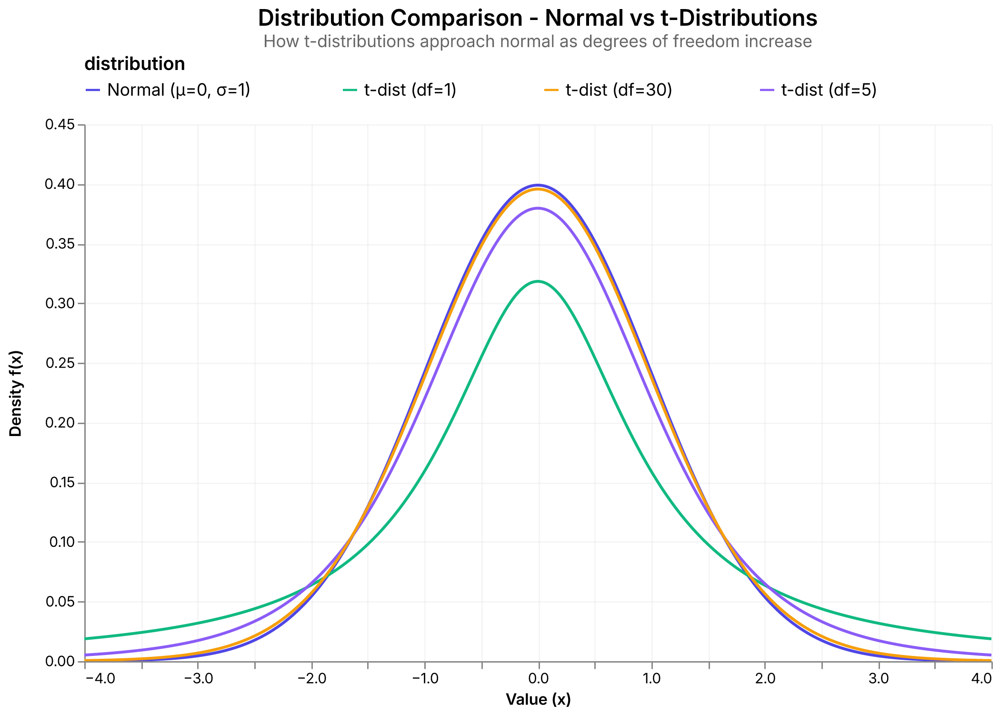

# Summary

Tidy-TS is a type-safe library for statistical computing, data transformation, and visualization in the TypeScript ecosystem. It introduces a functional grammar for manipulating tabular data using arrays of objects, which are the idiomatic format in JavaScript runtimes. Inspired by the tidyverse philosophy [@Wickham:2019], it brings static typing, schema validation, and compile time guarantees to data workflows in TypeScript.

The library supports pipelines that load data from files, APIs, or databases, apply transformations that preserve type information, run statistical analyses, and produce interactive visualizations using Vega-Lite [@Satyanarayan:2017; @Satyanarayan:2016]. These workflows remain entirely within TypeScript and avoid the need to switch languages for analysis or presentation.

Tidy-TS is designed for use in browsers, servers, and notebooks. It targets teams working fully in TypeScript who face fragmented toolchains and inconsistent data handling. Features such as asynchronous row-wise operations, concurrency controls, columnar storage, and WebAssembly acceleration support analytics workflows on millions of records in both research and production environments. The addition of a type system extends this paradigm to include substantive compile-time guarantees through static types, which existing literature suggests can prevent 15–38% of production bugs [@Gao:2017; @Bunge:2019; @Khan:2021].

# Statement of need

JavaScript and TypeScript are widely used for building interactive data applications, but they lack a type-aware and expressive toolkit for statistical computing. Existing libraries like Arquero and Danfo.js offer partial solutions for dataframe operations, but they do not provide a comprehensive type system for full data analysis pipeline.

Without a consistent type model for this work, developers are often left writing brittle glue code across loosely coupled tools. Many teams using TypeScript for data ingestion and application logic still rely on Python or R for analysis and modeling. This workflow involves exporting and reimporting data with assumptions about column names, types, and missing values.  Subtle errors such as incorrect joins, inconsistent handling of null and undefined values, or mismatched column references often go undetected until late stages. These issues create avoidable risk in data pipelines. Tidy-TS is designed to minimize this class of error.

This library implements and builds upon a tidyverse-style grammar of data manipulation using TypeScript's structural type system. Each operation in a pipeline maintains and refines the type signature of the data. For example, mutate not only adds a column but also updates the inferred structure, helping downstream transformations and visualizations remain type-safe. Operations like select, drop, join, pivot, and summarize also all preserve static typing. Descriptive statistics follow conventions from R but enforce type correctness at compile time rather than through runtime checks. For example, functions that summarize over potentially null values require the developer to explicitly handle missing data before returning numeric output. This type-safe approach is illustrated in Example 1, which demonstrates how a complete data analysis workflow maintains type information through transformations, grouping, and aggregation.


> **Example 1: Type-Safe Data Transformation Pipeline**
> 
> ```typescript
> import { createDataFrame, stats as s } from "@tidy-ts/dataframe";
> 
> const sales = createDataFrame([
>   { region: "North", product: "Widget", quantity: 10, price: 100 },
>   { region: "North", product: "Gizmo", quantity: 20, price: 50 },
>   { region: "South", product: "Widget", quantity: 20, price: 100 },
>   { region: "East", product: "Widget", quantity: 8, price: 100 },
> ]);
> 
> const analysis = sales
>   .mutate({ 
>     revenue: (row) => row.quantity * row.price,
>     moreQuantityThanAvg: (row, _i, df) => row.quantity > s.mean(df.quantity)
>   })
>   .groupBy("region")
>   .summarize({
>     total_revenue: (group) => s.sum(group.revenue),
>     avg_quantity: (group) => s.mean(group.quantity)
>   })
>   .arrange("total_revenue", "desc");
> ```

Tidy-TS also includes support for statistical hypothesis testing (Example 2). These functions are validated against R using randomized test suites to ensure parity in results. Output from statistical tests is returned in typed objects that contain test names, effect sizes, p-values, confidence intervals, and relevant statistics in a structured format. Providing these features natively is a priority for this work, particularly as research experiences a convergence between data collection and data analysis enabled by technologies like TypeScript and interactive applications. Example 2 demonstrates how Tidy-TS exposes statistical tests directly and via an API that guides users to the correct test based on their intention, invoking the tidyverse philosophy of human-centered design.  Both methods return the same structured, typed results.


> **Example 2: Statistical Hypothesis Testing with Type Safety**
> 
> ```typescript
> import { stats as s } from "@tidy-ts/dataframe";
> 
> // Create test "height" data for 6 individuals
> const heights = [170, 165, 180, 175, 172, 168];
> 
> // Direct test API
> // Access specific statistical tests
> const directTest = s.test.t.oneSample({
>   data: heights,
>   mu: 170,
>   alternative: "two-sided",
>   alpha: 0.05
> });
>
> // Compare API
> // Intent-driven hypothesis testing api 
> const compareAPI = s.compare.oneGroup.centralTendency.toValue({
>   data: heights,
>   comparator: "not equal to" // or "less than" | "greater than"
>   hypothesizedValue: 170,
>   parametric: "parametric", // or "nonparametric" | "auto"
>   alpha: 0.05
> });
> 
> // Both return the same typed result:
> // {
> //   test_name: "One-sample t-test",
> //   p_value: 0.47...,
> //   effect_size: { value: 0.31..., name: "Cohen's D" },
> //   test_statistic: { value: 0.76..., name: "T-Statistic" },
> //   confidence_interval: { lower: 166.08..., upper: 177.24..., 
> //     confidence_level: 0.95 },
> //   degrees_of_freedom: 5,
> //   alpha: 0.05,
> //   alternative: "Two-Sided"
> // }
> ```

Many modern analytics workflows also rely on remote API calls or external services for validation and analysis. Tidy-TS supports asynchronous transformations natively, permitting row-wise async operations within mutate, filter, and summarize operations. It also includes both dataframe-level and operation-level controls for concurrency and retries.  This eases the task of building analytics pipelines dependent on external services or subject to API rate limits. Applications that call remote artificial intelligence (AI) models or services are a key use case.

Modern workflows also ingest data from various sources.  Tidy-TS provides tools to import CSV, Parquet, Arrow, and JSON in a type-safe manner with the help of Zod schema.  Likewise, databases queries made with raw SQL can be made type-safe with schema validation.  For data queried via popular type-safe Object-Relational Mappers, Tidy-TS can create dataframes using their provided types directly.

Tidy-TS ultimately builds on lessons from tools like pandas, dplyr, and Polars and adapts them for modern Typescript development needs. Tidy-TS is tested on each commit with a suite of over 900 tests and across Node, Bun, Deno, and browser targets.

# Research applications

Tidy-TS supports many common data analysis workflows in research environments. At the University of Utah's Department of Biomedical Informatics, the library is used for healthcare data analysis where the added type safety aids in integrating between multiple data sources.  These projects include both ad hoc quality improvement analysis and real-time evaluation of clinical data streams intended for integration into the electronic health record.

The ability to perform asynchronous transformations also helps researchers to incorporate external data sources in an idiomatic pipeline. One can fetch data from a repository, process and clean it, invoke async AI tools, perform statistical testing, and visualize the results (see Figure 1) all within a single type-safe TypeScript workflow without switching to Python or R for analysis.



Tidy-TS runs in multiple environments including Node.js, Deno, Bun, and modern browsers. It can also be used interactively in Jupyter notebooks through the Deno kernel, enabling data analyses and exploration alongside graph outputs with minimal configuration. This extends the reach of the type-safe analytics and reproducibility to an interactive workflow commonly used in data science and research.

# Acknowledgements

No external funding was received in support of this work. The author is grateful to Dr. Kensaku Kawamoto for his mentorship and support, without which this work would not be possible.

Tidy-TS is also only possible due to numerous open source projects. Beyond the pioneering work by the tidyverse teams, the author would like to specifically acknowledge and give thanks for the excellent work by the University of Washington Interactive Data Lab for their inspirational work with Vega-Lite, Vega, and the arquero javascript library.